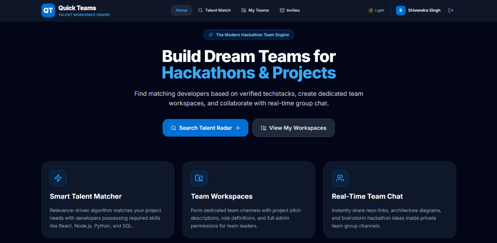
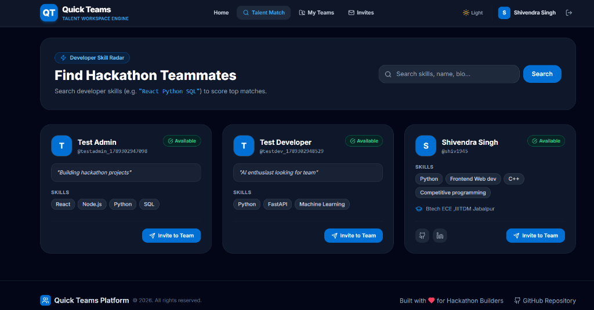
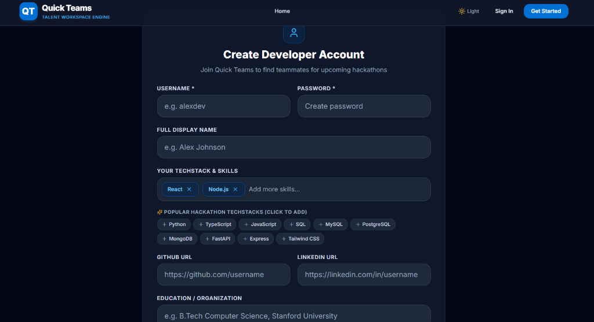
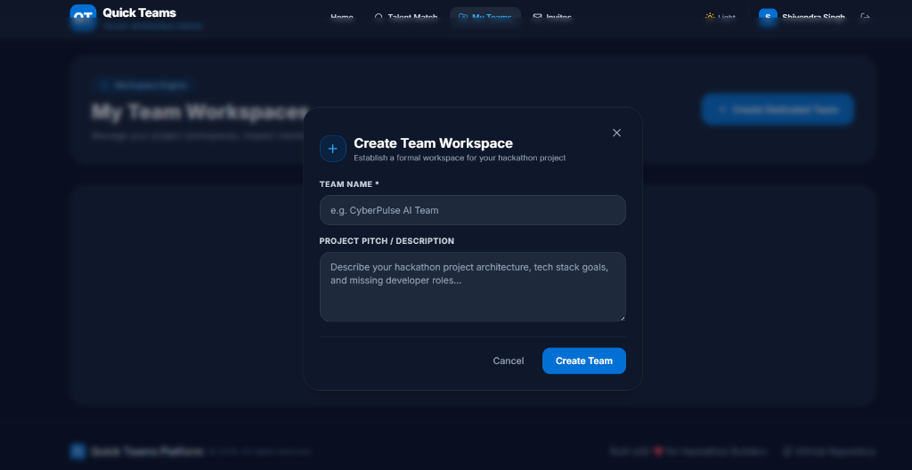

# Quick Teams — Modern Talent Workspace & Team Engine

[](https://reactjs.org/)
[](https://nodejs.org/)
[](https://fastapi.tiangolo.com/)
[](https://tailwindcss.com/)
[](https://sequelize.org/)

**Quick Teams** is an elegant, full-stack team workspace and developer matching engine designed to solve the hardest part of hackathons and tech projects: **building dream teams with verified techstacks and organizing project workspaces lightning-fast**.

---

## 📸 Application Screenshots

### 1. Hero Dashboard Landing Page
Modern, high-impact landing page highlighting live hackathon platform capabilities, active team workspaces, and developer search CTAs.



---

### 2. Smart Talent Match Radar
Browse developers using relevance-ranked skill scoring algorithms. Filter candidates by skills, view developer pitch bios, and send instant team invites.



---

### 3. Developer Account & Interactive Skill Selection
Clean developer onboarding featuring tokenized skill selection with autocomplete suggestions, popular techstack quick-chips, and talent search availability toggles.



---

### 4. Team Workspace & Project Creation
Establish formal team channels with project pitch descriptions, multi-admin management controls (`[Admin]` badges, promote/kick permissions), and real-time team chat.



---

## 🌟 Core Features

- **⚡ Smart Talent Matcher Radar:** Multi-attribute recommendation engine powered by a Python microservice to match developers based on query relevance and skill tags (`React`, `Node.js`, `Python`, `SQL`, etc.).
- **🏷️ Interactive Techstack Selector:** Seamless skill management with interactive token badges, autocomplete dropdowns, keyboard controls (`Enter`, `Comma`, `Backspace`), and preset techstack chips.
- **🛡️ Multi-Admin Team Workspaces:** Form dedicated project channels featuring custom project pitches, admin badges, administrative user promotion/kick controls, and leave-team capabilities.
- **💬 Real-Time Team Chat:** Integrated group messaging in every team workspace for exchanging repository links, system architecture diagrams, and hackathon ideas.
- **🌗 Light & Dark Theme Switcher:** Built-in native theme manager with custom CSS variables and smooth transitions across dark and light modes.
- **🟢 Search Availability Toggle:** Easily toggle your profile status between *"Looking for Team"* and *"Just Browsing"* to control radar visibility.

---

## 🛠️ Architecture & Technology Stack

| Layer | Framework / Technologies | Description |
| :--- | :--- | :--- |
| **Frontend** | React 18, Vite, Redux Toolkit, React Router v6, Tailwind CSS, Lucide Icons | Responsive single-page application with centralized state management for auth, teams, matches, and themes. |
| **Backend API** | Node.js, Express.js, Sequelize ORM, JWT, BcryptJS, Multer | RESTful API supporting dual-mode database operation: MySQL for production and SQLite fallback for local dev. |
| **Recommendation Engine** | Python, FastAPI, Pydantic, Custom Skill Scoring Engine | Multi-word tokenization and relevance-scoring microservice for candidate ranking. |

---

## 📁 Repository Structure

```
Quick-Teams-web-app-1/
├── frontend/                 # React + Redux Toolkit + Tailwind CSS Client
│   ├── src/
│   │   ├── api/             # Axios instance & interceptors
│   │   ├── components/      # Navbar, SkillSelector, InviteModal, ToastAlert
│   │   ├── store/           # Redux slices (auth, team, match, theme)
│   │   └── pages/           # Home, Login, Register, Matches, MyTeams, Workspace, Profile
│   ├── package.json
│   └── vite.config.js
│
├── backend/                  # Node.js + Express REST API Server
│   ├── config/              # Database connection (MySQL / SQLite fallback)
│   ├── models/              # Sequelize models (User, Team, TeamMember, Request, Message)
│   ├── controllers/         # Auth, User, Team, Invite, Chat logic
│   ├── routes/              # Express route definitions
│   └── server.js
│
├── python-services/          # Python Recommendation Microservice
│   ├── matcher.py           # Skill tokenization & relevance ranking logic
│   ├── main.py              # FastAPI endpoints (/health, /api/v1/recommend)
│   └── requirements.txt
│
└── docs/assets/              # Application screenshots & visual assets
```

---
## 💻 Local Development Setup

### 1. Prerequisites
- **Node.js** (v18+) & **npm**
- **Python** (v3.9+)

---

### 2. Backend Setup (Node.js API)
```bash
cd backend
npm install
node server.js
```
*The backend API will start on `http://localhost:5000` with SQLite database automatically initialized.*

---

### 3. Recommendation Microservice (Python FastAPI)
```bash
cd python-services
pip install -r requirements.txt
python main.py
```
*The Python FastAPI recommendation service will start on `http://localhost:8000`.*

---

### 4. Frontend Setup (React + Vite)
```bash
cd frontend
npm install
npm run dev
```
*Open `http://localhost:3000` in your browser to launch the Quick Teams application.*

---

## 🧪 Build Verification

To compile the production frontend build:
```bash
cd frontend
npm run build
```

---

*Built with ❤️ for Hackathon Builders & Developer Teams.*
